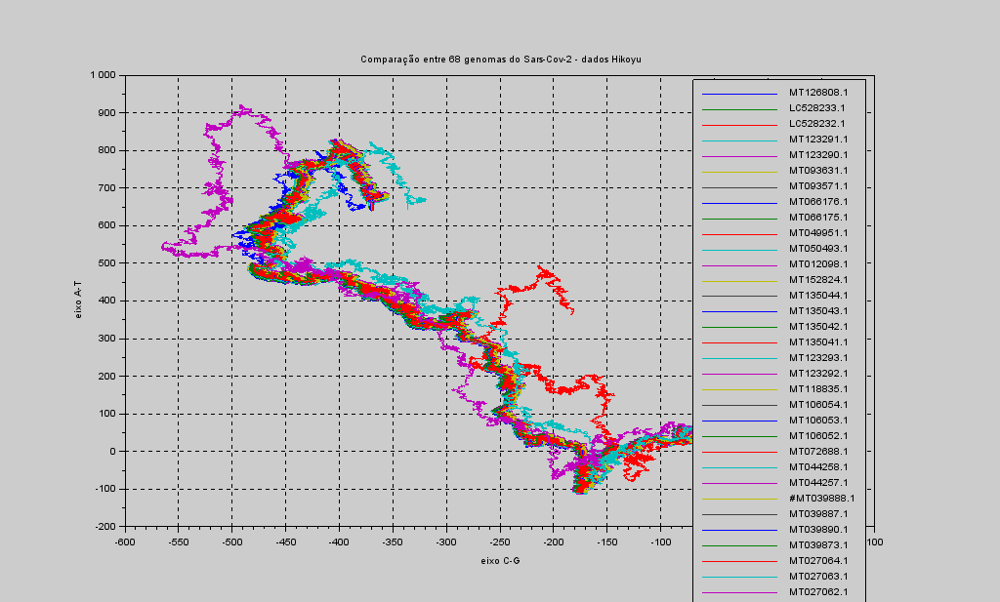
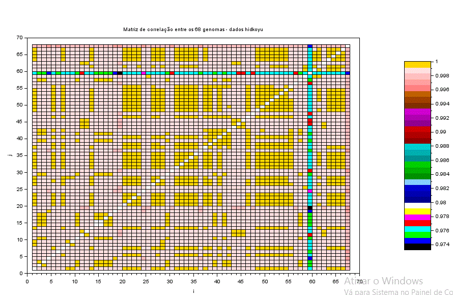
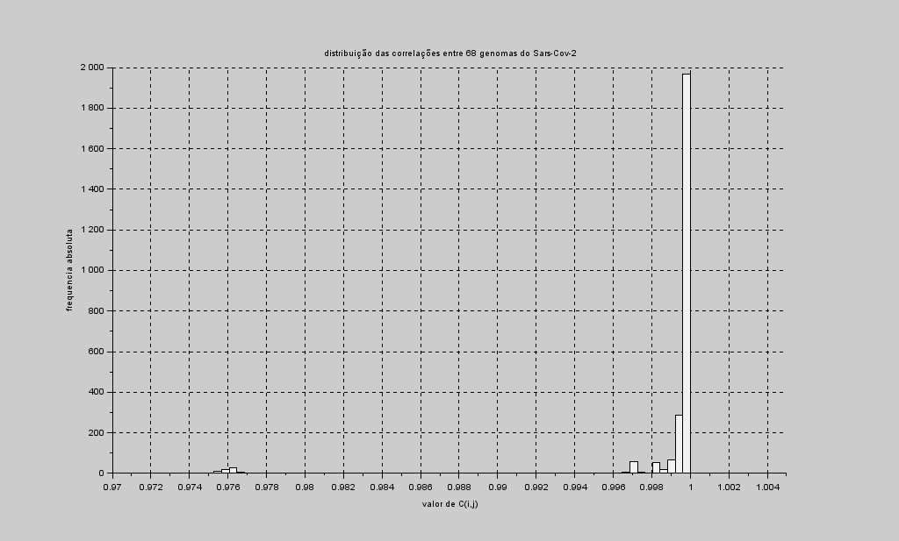

# Covid-19
> forked from gariandi/Covid-19

Data-science x Covid-19: análise de genomas
Usando alguns dados do github do Hikoyu Suzuki:

* https://github.com/Hikoyu/SARS-CoV-2/tree/master/genome

Você vai precisar do Scilab. Se não tem é só baixar gratuitamente em https://www.scilab.org/ .
O arquivo de dados e o sample_list devem ficar no mesmo diretório do ComparaGenomas.sce.

Após instalar, basta chamar na linha de comando do Scilab:

```bash
M = ComparaGenomas('dados hikoyu.txt')
````

O `M` vai ser a matriz de correlação. 
Você pode fazer uma visualização dela com os comandos:

```bash
surf(M); 
colorbar()
```

### Artigo

Representação e Visualização de dados de genoma COVID-19:

    Publicado em 19 de março de 2020
    LinkedIn Gabriel de Andrade Silva
    https://www.linkedin.com/pulse/representa%25C3%25A7%25C3%25A3o-e-visualiza%25C3%25A7%25C3%25A3o-de-dados-covid-19-de-andrade-silva/?trackingId=S%2FM0spcPQRSz869oMtubUQ%3D%3D

Em 2012, num momento em que o hype da Bioinformática e Data Mining estava se começando, me propus a tentar implementar um algoritmo de visualização de genoma.

Era um trabalho de graduação (disciplina BCC - "Bases Computacionais da Ciência"). Analisamos os genomas mais simples possíveis: os de vírus. Demorou até descobrirmos como baixar uns poucos dados do NCBI. Eram arquivos de alguns kb. Nos sugeriram comparar genomas de HIVs. Tínhamos o HIV tipo 1, o tipo 2, o SIV e o SHIV.

Foi maravilhoso ver que a representação convergia com os que já se sabia sobre estes vírus. As figuras do tipo 1 e do SHIV ficaram muito próximas, confirmando seu parentesco.

2020: pandemia daqui, aulas suspensas, home office dali, me lembro desse trabalho. Encontro o código, jogado em algum canto, esquecido. Insiro dados do SARS-Cov-2. E não saem belas figuras?




A comparação mostra muitas linhas retorcidas, cada uma de uma cor, representando os genomas de diferentes cepas do coronavirus

Certamente daria para comentar muita coisa desta representação, porque ele incluiu cepas de vírus originários de animais também. Possivelmente estas curvas que saem mais fora correspondem a essas linhagens não-humanas.

Mas minha curiosidade se voltou para outro ponto. Decidi ir um pouco além , implementando alguma métrica numérica de comparação. Por que não correlacionar?



Não foi fornecido texto alternativo para esta imagem

Apesar do alto grau de semelhança ainda assim é possível discernir algumas famílias de amostras mais próximas, como podemos ver pelos picos do histograma a seguir.

imagem [DISTRIBUIÇÃO CORRELAÇÕES]


Fiquei feliz de ver que meu parcos conhecimentos em Bioinformática ainda parecem apontar alguma direção.

Essa crise perdurando, vamos nos entretendo. Além disso, talvez até podemos eventualmente colaborar para ajudar nessa luta. Alguém mais se habilita?
